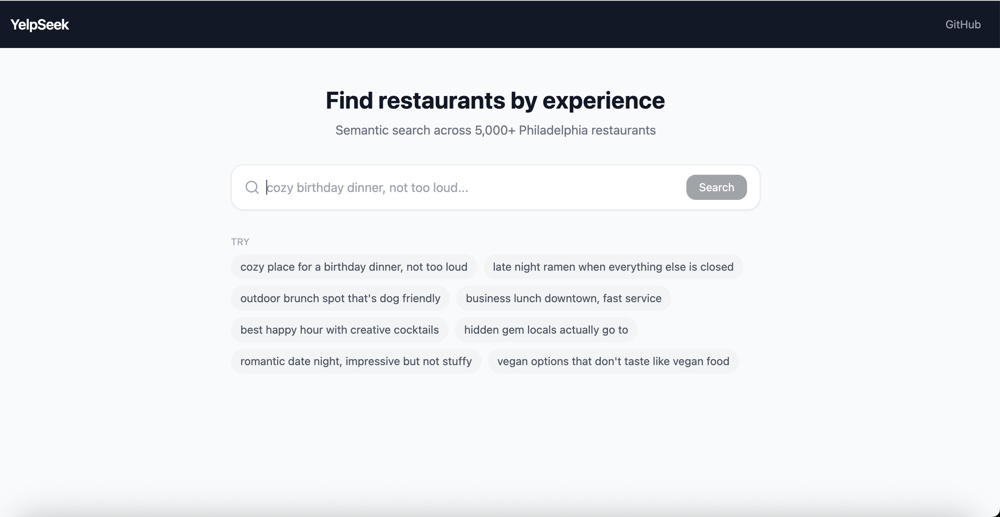
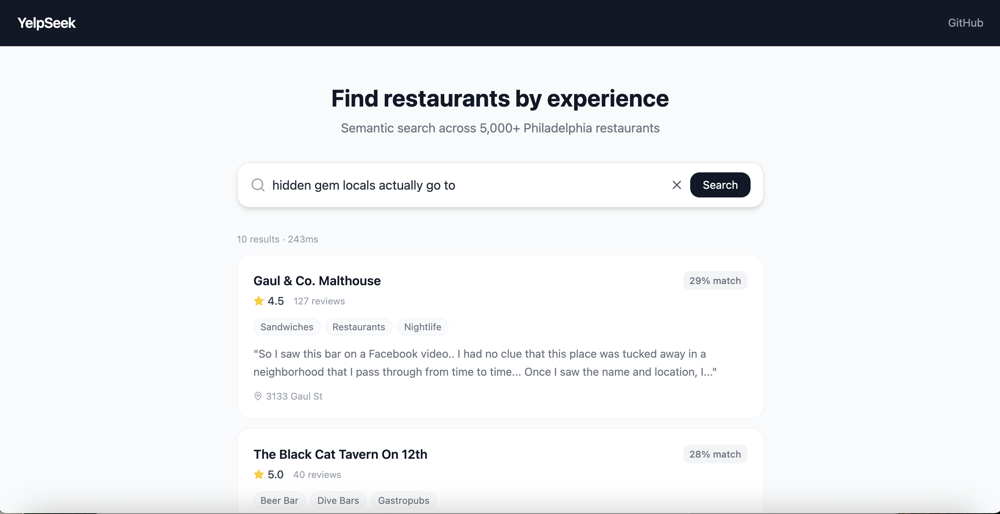

# YelpSeek

Semantic restaurant search engine over 5,000+ Philadelphia restaurants. Instead of keyword matching, YelpSeek understands the *meaning* of natural language queries and retrieves restaurants whose reviews describe that experience.

> "cozy birthday dinner, not too loud" → returns intimate restaurants with great atmosphere, even if those exact words don't appear in any review.




---

## How It Works

1. **Data pipeline** — Filters the Yelp Open Dataset to Philadelphia restaurants, aggregates top-10 reviews per restaurant
2. **Training** — Fine-tunes `BAAI/bge-base-en-v1.5` (dual-encoder) on 188K+ query-document pairs using contrastive learning
3. **Indexing** — Encodes all restaurant documents and builds a FAISS HNSW index for sub-100ms retrieval
4. **Serving** — FastAPI backend + React/TypeScript frontend

---

## Setup

### Prerequisites
- Python 3.12+
- Node.js 18+
- Yelp Open Dataset JSON files (download at [yelp.com/dataset](https://www.yelp.com/dataset))

### 1. Data Pipeline (run once)

```bash
cd ml
python3 -m venv venv && source venv/bin/activate
pip install -r requirements.txt

# Stage 1: Process raw Yelp data
python3 01_process_data.py --city "Philadelphia"

# Stage 2: Generate training pairs
python3 02_generate_pairs.py --strategy both --openai-key YOUR_KEY
# or free (pseudo only):
python3 02_generate_pairs.py --strategy pseudo
```

### 2. Train the Model (Google Colab recommended)

Upload `ml/03_train_encoder.py`, `data/processed/restaurant_docs.parquet`, and `data/processed/training_pairs.jsonl` to Google Colab, then:

```bash
!pip install sentence-transformers pandas pyarrow
!python3 03_train_encoder.py --batch-size 64
```

Save the best checkpoint (`models/encoder_v1/best`) back to your machine.

### 3. Build the FAISS Index

```bash
python3 05_build_index.py --model ../models/encoder_v1/best
```

This outputs `backend/data/index.faiss` and `backend/data/metadata.parquet`.

### 4. Run the Backend

```bash
cd backend
python3 -m venv venv && source venv/bin/activate
pip install -r requirements.txt

# Create .env
echo "MODEL_PATH=../models/encoder_v1/best" > .env
echo "INDEX_PATH=data/index.faiss" >> .env
echo "METADATA_PATH=data/metadata.parquet" >> .env

uvicorn main:app --reload --port 8000
```

### 5. Run the Frontend

```bash
cd frontend
npm install
npm run dev
```

Open [http://localhost:5173](http://localhost:5173).

---

## Tech Stack

| Layer | Technology |
|-------|-----------|
| ML | PyTorch, sentence-transformers, FAISS |
| Backend | FastAPI, Uvicorn |
| Frontend | React 18, TypeScript, Vite, Tailwind CSS |
| Data | Pandas, Parquet |
